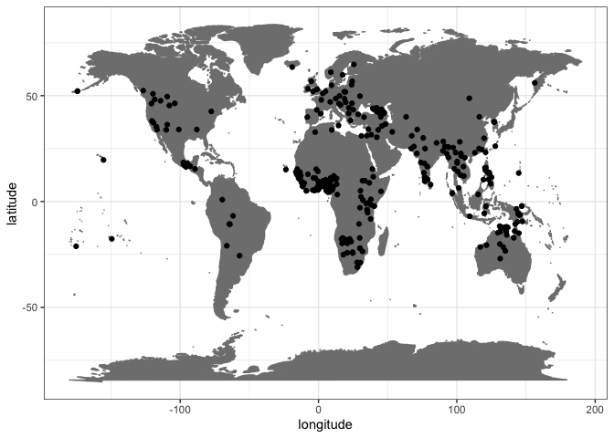
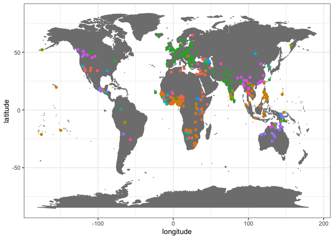

Combine UCLA Phonetics Lab Archive metadata with Glottolog metadata
================
Steven Moran
2023-10-09

``` r
library(tidyverse)
library(knitr)
```

I took the the UCLA Phonetics Archive:

- <http://archive.phonetics.ucla.edu/Language%20Indices/index_available.htm>

And first created a CSV file of their language names and ISO codes by
hand.

Then we load the hand created table.

``` r
ucla <- read_csv('ucla_metadata.csv')
```

Then load the Glottolog geo data.

``` r
glottolog_geo <- read_csv(url('https://cdstar.eva.mpg.de//bitstreams/EAEA0-B701-6328-C3E3-0/languages_and_dialects_geo.csv'))
```

Let’s see what doesn’t match by joining them. Actually, looks
surprisingly pretty good – only a few retired ISO codes that we can
curate by hand, if needed.

``` r
ucla$iso_6393 <- tolower(ucla$`Ethnologue Code`)
ucla_glottlog <- left_join(ucla, glottolog_geo, by=c("iso_6393"="isocodes"))
```

Now we can map them. :)

``` r
ggplot(data=ucla_glottlog, aes(x=longitude, y=latitude)) + 
  borders("world", colour="gray50", fill="gray50") + 
  geom_point() +
  theme_bw()
```

    ## Warning: Removed 6 rows containing missing values (`geom_point()`).

<!-- -->

Let’s add in language family data. This must be downloaded from
Glottolog (updated per release) instead of read directly from the
website, like above.

``` r
glottolog_families <- read_csv('glottolog_languoid/languoid.csv')
```

Join them again.

``` r
ucla_glottlog <- left_join(ucla_glottlog, glottolog_families)
```

    ## Joining with `by = join_by(name, level, latitude, longitude)`

And map them by family.

``` r
ggplot(data=ucla_glottlog, aes(x=longitude, y=latitude, color=family_id)) + 
  borders("world", colour="gray50", fill="gray50") + 
  geom_point() +
  theme_bw() +
  theme(legend.position="none")
```

    ## Warning: Removed 6 rows containing missing values (`geom_point()`).

<!-- -->

Write the combined data as csv.

``` r
head(ucla_glottlog) %>% kable()
```

| Language  | Ethnologue Code | iso_6393 | glottocode | name      | level    | macroarea |  latitude | longitude | id       | family_id | parent_id | bookkeeping | iso639P3code | description | markup_description | child_family_count | child_language_count | child_dialect_count | country_ids       |
|:----------|:----------------|:---------|:-----------|:----------|:---------|:----------|----------:|----------:|:---------|:----------|:----------|:------------|:-------------|:------------|:-------------------|-------------------:|---------------------:|--------------------:|:------------------|
| Abaza     | ABQ             | abq      | abaz1241   | Abaza     | language | Eurasia   |  44.25000 |  42.00000 | abaz1241 | abkh1242  | abkh1243  | FALSE       | abq          | NA          | NA                 |                  0 |                    0 |                   3 | RU TR             |
| Abkhaz    | ABK             | abk      | abkh1244   | Abkhaz    | language | Eurasia   |  43.05622 |  41.15911 | abkh1244 | abkh1242  | abkh1243  | FALSE       | abk          | NA          | NA                 |                  0 |                    0 |                   3 | GE RU TR          |
| Aceh      | ACE             | ace      | achi1257   | Acehnese  | language | Papunesia |   3.90757 |  96.60320 | achi1257 | aust1307  | cham1327  | FALSE       | ace          | NA          | NA                 |                  0 |                    0 |                   7 | ID                |
| Adyghe    | ADY             | ady      | adyg1241   | Adyghe    | language | Eurasia   |  44.00000 |  39.33000 | adyg1241 | abkh1242  | circ1239  | FALSE       | ady          | NA          | NA                 |                  0 |                    0 |                   5 | IL JO RU SY TR    |
| Afrikaans | AFR             | afr      | afri1274   | Afrikaans | language | Africa    | -22.00000 |  30.00000 | afri1274 | indo1319  | afri1273  | FALSE       | afr          | NA          | NA                 |                  0 |                    0 |                   3 | BW MZ NA ZA ZM ZW |
| Aghul     | AGX             | agx      | aghu1253   | Aghul     | language | Eurasia   |  41.92420 |  47.58430 | aghu1253 | nakh1245  | aghu1260  | FALSE       | agx          | NA          | NA                 |                  0 |                    0 |                   6 | AZ RU             |

``` r
write_csv(ucla_glottlog, 'ucla_glottlog.csv')
```
